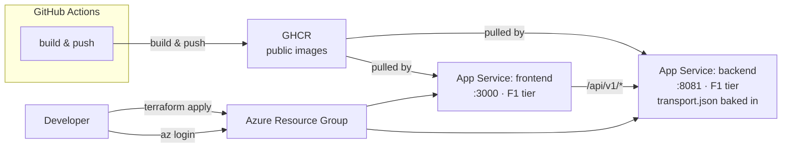

# transitCloud

Terraform infrastructure-as-code for deploying a Tunisian public transport
application on Microsoft Azure.

## What it is

Deploys two Docker-containerized web apps (Go backend + Next.js frontend)
on Azure App Service, pulling images from GitHub Container Registry (GHCR).

Currently in **dev** environment. CI validates Terraform on push; deploys
are manual.

## Architecture



> **Note:** `transport.json` is baked into the backend Docker image at build time — there is no external database. Cosmos DB was provisioned and deliberately removed (see Key Decisions).

## Key Decisions

| Decision | Rationale |
|----------|-----------|
| **Azure (France Central)** | University-provided account with $100 credits |
| **GHCR over Azure Container Registry** | ACR costs extra; GHCR is free for public repos, already on GitHub |
| **F1 (Free tier) App Service** | Cost optimization for dev; sufficient for current load |
| **Linux over Windows** | Better Docker support, lower cost |
| **Cosmos DB removed** | Was provisioned then deliberately removed — static JSON is fine at this scale |
| **Manual `terraform apply`** | ESPRIT Azure AD tenant blocks student accounts from registering app registrations → no service principal → no OIDC → CI can only validate, not plan/apply |

## Tech Stack

| Layer | Technology |
|-------|-----------|
| IaC | Terraform, azurerm v4.78.0 |
| Backend | Go 1.24, Gorilla Mux, A* pathfinding |
| Frontend | Next.js 15, React 19, Tailwind v4, Leaflet maps |
| Containers | Docker multi-stage builds |
| CI/CD | GitHub Actions (validate only — no service principal) |

## Modules

| Module | Description |
|--------|-------------|
| [resource_group](docs/modules/resource_group.md) | Azure resource group |
| [app_service_plan](docs/modules/app_service_plan.md) | Linux App Service Plan |
| [web_app](docs/modules/web_app.md) | Linux Web App (Docker container) |
| [cosmos_db](docs/modules/cosmos_db.md) | Cosmos DB MongoDB API (defined, not deployed) |

## Prerequisites

- Azure subscription with active credits
- Terraform >= 1.5.7
- Docker images pushed to GHCR (`ghcr.io/<owner>/transit-backend`, `ghcr.io/<owner>/transit-frontend`)

## Quick Start

```bash
# Authenticate
az login

# Clone
git clone https://github.com/MRGHOSJ/transitCloud.git
cd transitCloud

# Configure
cp terraform.tfvars.example terraform.tfvars
# Edit terraform.tfvars with your values

# Deploy
terraform init
terraform plan
terraform apply
```

> **Note:** `terraform apply` must be run manually — CI cannot deploy due to Azure AD tenant restrictions.

## Deploying updates

Azure App Service caches `:latest` images and does not auto-pull on push.
After pushing a new image to GHCR, restart the app:

```bash
az webapp restart --name <app-name> --resource-group <rg-name>
```

## Known Limitations

- **F1 Free tier**: No SLA, limited to 60 min/day CPU time, cold starts
- **No monitoring**: No Application Insights or diagnostics configured
- **No Key Vault**: Secrets (registry credentials) are in terraform.tfvars, not vaulted
- **Static data**: Transit data is a JSON file, not a database — Cosmos DB is defined in modules/ but not deployed; add it if a stateful feature (user accounts, favorites) is needed
- **Manual deploys**: No CI/CD for `terraform apply` due to Azure AD tenant restrictions

## Cost Management

The $100 university credit is finite. Run `terraform destroy` when not actively
demoing to preserve credits.
